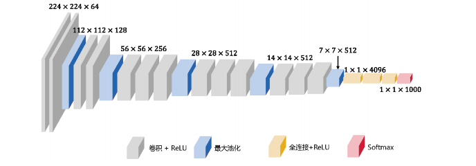
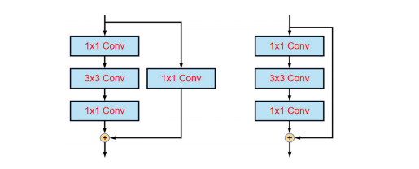

#### 一 经典卷积神经网络

[TOC]

###### 1 AlexNet 

```python
AlexNet 总共包括 8 层，其中前 5 层为卷积层，后 3 层为全连接层,卷积核比较大核 (11×11、5×5、3×3)
AlexNet 是深度学习领域的里程碑之一，引领了卷积神经网络在计算机视觉任务中的应用，它证明了深度卷积神经网络的能力，  
经过卷积输出的计算公式：OUT_size = (IN_size - F_size + 2P )/S   +  1
```


###### 2 VGG 

```pyhton
VGG 的主要工作是证明增加网络的深度能够在一定程度上影响网络最终的性能,相比于 AlexNet 的改进是采用连续几个 3×3 卷积核代替较大的卷积核。
用 3 个 3×3 卷积核可以代替 1 个7×7 卷积核。
用 2个 3×3 卷积核可以代替 1 个 5×5 卷积核。
```


###### 3 GoogLeNet

```python
GoogLeNet 是经典卷积网络，引入了 Inception 模块。
使用多个尺寸的卷积核并行计算，所以融合了不同尺度的特征信息。
使用 1x1 卷积核(可以看作通道维度全连接)进行降维。
1x1 卷积核实现了通道之间的信息交换，降低了计算量。
添加了两个辅助分类器来辅助训练。
```


4 ResNet

```python
Deep Residual Network，深度残差网络,由微软实验室的何凯明等人提出的的
ResNet 之前所有的神经网络都是通过卷积层和池化层的堆叠组成的,残差学习相比于原始特征直接学习会更加容易。
当残差为 0 时，堆积层仅仅做了恒等映射，至少网络性能不会下降，而实际上残差不会为 0，这也会使堆积层在输入特征基础上学习到新的特征，从而拥有更好的性能。
```




###### 5 DarkNet


###### 6 SENet


```python
SEblock 引入的是一种叫做通道注意力机制,大致是提取每个卷积核通道中的特征，然后综合这些特征来获得一些通道之间的联系，得到每个通道的权重，然后在与原来输入数据相乘， 经过 SENet 的输出和输入 shape 是保持一致的，就是没有改变数据结构，这就使得 SENet 模块非常灵活，可以在你的网络结构中随意位置添加，是水创新的利器,以下是 pytorch 代码实现
```
```python
class SEnet(nn.Module):
    def __init__(self, in_channels, reduction=16):
        super(SEnet, self).__init__()
        self.avg_pool = nn.AdaptiveAvgPool2d(1)
        self.fc1 = nn.Linear(in_channels, in_channels // reduction)
        self.relu = nn.ReLU()
        self.fc2 = nn.Linear(in_channels // reduction, in_channels)
        self.sigmod = nn.Sigmoid()

    def forward(self, x):                 ##   假如 shape 是 (4, 3, 256, 256)
        b, c, h, w = x.size()             ##   获取输入数据的 b、c、h、w 值
        out = self.avg_pool(x)            ##   经过平均池化，h w 变为了 1  shape 是 (4, 3, 1, 1)
        out = out.view(b,-1)    #   shape 变成了 (4, 3)
        out = self.fc1(out)     # 第一个全连接层
        out = self.relu(out)    # ReLU 激活函数
        out = self.fc2(out)     # 第二个全连接层
        out = self.sigmod(out)  # Sigmoid 激活函数
        out = out.view(b, c, 1, 1)  # 将输出重新 reshape 为原来形状  (b, c, 1, 1)
        out = x * out  # 将特征图与通道权重相乘
        return out
```


#### 二 轻量化卷积神经网络

###### 1 MobileNet

```
深度可分离卷积是 MobileNet 的基本单元。
深度卷积与标准卷积不同，对于标准卷积，其卷积核用在所有输入通道 Channel上。
而深度卷积针对每个输入通道采用不同的卷积核。
即一个卷积核对应一个输入通道，所以说深度卷积是逐通道的操作。
简单来说，普通卷积层的特征提取与特征组合一次完成并输出。
而深度卷积则将特征提取与特征组合分开进行。
```


```
MobileNet V2 同样借鉴了 ResNet，采用了残差结构，将输出与输入相加。
但是 ResNet 中的残差结构是先降维卷积再升维，而 MobileNet V2 则是先升维卷积再降维。
ResNet 的残差结构更像是一个沙漏。
MobileNet V2 中的残差结构则更像是一个纺锤，两者刚好相反。
```


###### 2 shuffleNet

###### 3 GhostNet

