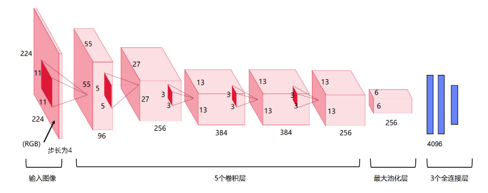
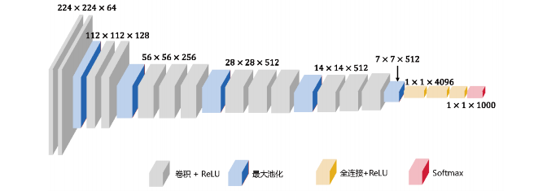
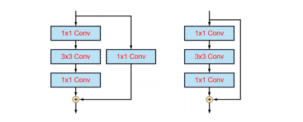
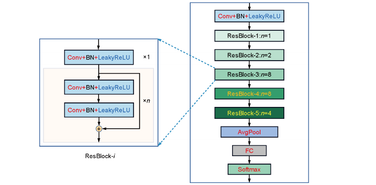

#### 一 经典卷积神经网络

[TOC]

###### 1 AlexNet 

```python
AlexNet 总共包括 8 层，其中前 5 层为卷积层，后 3 层为全连接层,卷积核比较大核 (11×11、5×5、3×3)
AlexNet 是深度学习领域的里程碑之一，引领了卷积神经网络在计算机视觉任务中的应用，它证明了深度卷积神经网络的能力，为后续深度学习研究奠定了基础。  OUT_size = (IN_size - F_size + 2P )/S   +  1
```




###### 2 VGG 

```pyhton
VGG 的主要工作是证明增加网络的深度能够在一定程度上影响网络最终的性能,相比于 AlexNet 的改进是采用连续几个 3×3 卷积核代替较大的卷积核，用 3 个 3×3 卷积核可以代替 1 个7×7 卷积核，使用 2个 3×3 卷积核可以代替 1 个 5×5 卷积核。
```


###### 3 GoogLeNet

```
GoogLeNet 是经典卷积网络，使用 1x1 卷积核进行降维，降低了计算量。 
```


###### 4 ResNet

```python
Deep Residual Network，深度残差网络,由微软实验室的何凯明等人提出的的, ResNet 之前所有的神经网络都是通过卷积层和池化层的堆叠组成的,残差学习相比于原始特征直接学习会更加容易。当残差为 0 时，堆积层仅仅做了恒等映射，至少网络性能不会下降，而实际上残差不会为 0，这也会使堆积层在输入特征基础上学习到新的特征，从而拥有更好的性能。
```




###### 5 DarkNet
```pyhton

```

)


###### 6 SEnet


#### 二 轻量化卷积神经网络

###### 1 MobileNet
###### 2 shuffleNet
###### 3 GhostNet


